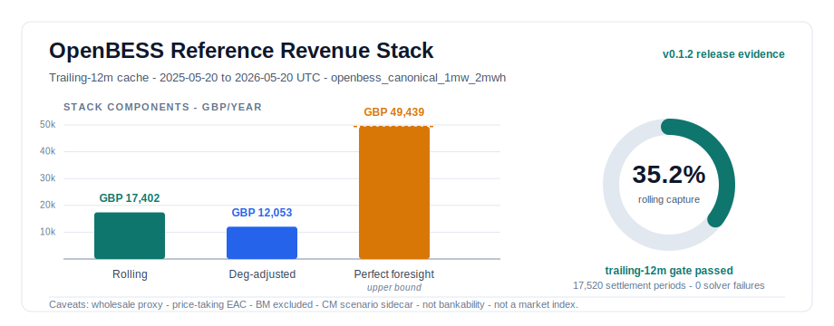

# OpenBESS

[](https://github.com/quinceng/OpenBESS/actions/workflows/ci.yml)

OpenBESS is a transparent public-data research model for Great Britain battery
energy storage revenue stacks. It combines Elexon BMRS Market Index Data as a
wholesale proxy, NESO EAC price-taking availability value, Capacity Market
scenario sidecars, degradation adjustments and no-leakage rolling policy
evaluation.

It is designed for technical review: assumptions are written down, source
snapshots are labelled, dashboard outputs are cached, and the default test suite
runs without live network calls. It is not trading software, investment advice,
a bankability model, an official market index or a proprietary benchmark
replication.

The headline values below are current main-branch evidence generated after the
`v0.1.1` tag. The latest tagged release note still documents the earlier 90-day
preview cache; `CHANGELOG.md` records this post-tag trailing-12-month promotion.



Use `results/dashboard/release_trailing_12m_historical` for the headline
dashboard. The older `results/dashboard/release_90d_historical` cache is kept
only as historical preview evidence for comparison.

## Key Results

The current mainline evidence cache uses the canonical
`openbess_canonical_1mw_2mwh` reference asset over the trailing-12-month
historical window from `2025-05-20T00:00:00Z` to `2026-05-20T00:00:00Z`.

| Result | Value |
| --- | ---: |
| Perfect-foresight upper-bound value | GBP 49,438.74 |
| Previous-day rolling policy value | GBP 17,402.24 |
| Previous-day capture ratio | 35.20% |
| Degradation-adjusted rolling value | GBP 12,053.15 |
| Capacity Market annual sidecar [1] | GBP 12,564.00/MW-year |
| Solver failures | 0 |
| Trailing-12-month target coverage | 100.00% |

Note [1]: Annual scenario sidecar; not settlement-period dispatch revenue.

These numbers are release evidence, not a bankability or investment claim. The
cache passes the preferred `trailing_12m` coverage gate for the reference asset,
but it still carries the project caveats: wholesale proxy, price-taking EAC,
Balancing Mechanism exclusion, Capacity Market scenario sidecar and
`not_a_market_index`. In plain English, `not_a_market_index` means these are
modelled research outputs, not an official or independently administered market
benchmark.

Audit the headline numbers against the generated cache files at
`results/dashboard/release_trailing_12m_historical/manifest.json` and
`results/runs/release_cache_trailing_12m_historical/summary.json`. The
release cache run ID is
`release_cache_elexon_mid_neso_eac_2025_05_20_0000_2026_05_20_0000_utc`.
The rolling-policy manifest uses 48 half-hour settlement periods per daily run,
365 daily runs, and a previous-day same-period forecast, meaning the forecast is
the prior day's price for the same settlement period.
Do not compare the 90-day and trailing-12-month capture ratios as simple scale
factors. They cover different historical months and price-shape mixes, so both
the perfect-foresight upper bound and rolling-policy value change with the
sample.

## What The Model Does

OpenBESS models a reference GB BESS against a deliberately narrow public-data
stack:

1. Elexon BMRS MID wholesale proxy value.
2. NESO EAC price-taking availability value.
3. Capacity Market annual scenario value.
4. Throughput-based degradation adjustment.

It compares perfect-foresight dispatch with rolling policies that only use data
known at the decision time:

```text
known_at_utc <= decision_time_utc
```

The rolling policy evidence is intentionally auditable rather than commercial.
The canonical full-year cache uses the previous-day same-period baseline. The
side-by-side previous-day versus trailing seven-day mean diagnostic remains in
the historical 90-day preview and Phase 6 evidence so the effect of forecast
choice stays visible without recomputing every supplementary diagnostic in the
full-year release job.

## OpenBESS Stack Index

The OpenBESS Stack Index is a reference Great Britain battery metric built from
public-source cache files. It reports a rolling value view with separate
components for wholesale proxy value, EAC availability value, Capacity Market
scenarios and a degradation-adjusted view.

The index is intentionally cautious. Short data samples stay labelled as
preview evidence. Annualised finance outputs and public benchmark comparisons
remain caveated because they are scenario appraisals, not proprietary benchmark
replication or bankability analysis.

## Current Scope

The repository currently includes public source research, source metadata, and
known time handling for Elexon MID, NESO EAC, Capacity Market assumptions, and
public benchmark anchors.

It includes typed schemas for batteries, market data, source records, and
dispatch results. A schema is a structured definition of what fields a record
must contain and what type each field should have.

It includes optimisation models for energy dispatch and reserve availability.
Optimisation means choosing the best feasible battery schedule under a set of
constraints. Constraints are rules such as power limits, state of charge limits,
and reserve headroom requirements.

It includes a cache-backed Streamlit dashboard. Streamlit is a Python tool for
building simple data applications. Cache backed means the dashboard reads saved
files rather than calling live data sources or solving models when the page
loads.

It also includes residential battery examples, including household bill
simulation, payback scenarios, and named sensitivity runs.

## Repository Layout

The package source code lives in `src/gb_bess_revenue_stack/`.

The dashboard lives in `dashboard/`.

Public assumptions and reference asset presets live in `configs/`.

Small public reference tables live in `data/reference/`.

Methodology, assumptions, source boundaries, and release notes live in `docs/`.

Lightweight reproducible smoke output summaries live in `reports/`.

Unit tests and optional live integration tests live in `tests/`.

## Setup

Install the project and its optional development dependencies with uv.

```bash
uv sync --all-extras
```

## Checks

Run these checks before publishing changes.

```bash
uv run ruff check .
uv run ruff format --check .
uv run mypy src
uv run pytest
```

Ruff checks code style and common Python mistakes. Mypy checks Python type
hints. Pytest runs the test suite.

Integration tests can call live public services, so they are switched off by
default.

```bash
GB_BESS_RUN_INTEGRATION=1 uv run pytest -m integration
```

## Useful Commands

These commands run the main network-free examples.

```bash
uv run gb-bess run-smoke
uv run gb-bess run-rolling-smoke
uv run gb-bess run-market-stack-smoke
uv run gb-bess run-phase4-smoke --finance-assumptions-yaml configs/finance_assumptions.yaml
uv run gb-bess build-phase4-aligned-cache --days 7 --output-dir results/runs/release_cache/aligned_sources
uv run gb-bess run-release-cache --aligned-cache-dir results/runs/release_cache/aligned_sources
uv run gb-bess build-stack-series --cache-dir results/dashboard --output-dir results/dashboard
uv run gb-bess run-residential-scenario-sweep
uv run streamlit run dashboard/streamlit_app.py
```

## Run The Canonical Dashboard

The canonical trailing-12-month dashboard cache is generated under:

```text
results/dashboard/release_trailing_12m_historical
```

That cache is not committed because `results/` is ignored. A public clone must
either rebuild it as a long-running release job over live public APIs or restore
it from a separately published artefact. After rebuilding or restoring that
cache locally from the current checkout, run the dashboard against it explicitly:

```bash
GB_BESS_DASHBOARD_CACHE_DIR=results/dashboard/release_trailing_12m_historical \
  uv run streamlit run dashboard/streamlit_app.py
```

In PowerShell:

```powershell
$env:GB_BESS_DASHBOARD_CACHE_DIR="results/dashboard/release_trailing_12m_historical"
uv run streamlit run dashboard/streamlit_app.py
```

`GB_BESS_DASHBOARD_CACHE_DIR` was introduced post-v0.1.1 to select named
dashboard caches. Without it, the dashboard reads
`results/dashboard`, which remains useful for the short network-free smoke
cache.

If you only want the short network-free demo cache, use:

```bash
uv run gb-bess run-phase4-smoke --finance-assumptions-yaml configs/finance_assumptions.yaml
uv run streamlit run dashboard/streamlit_app.py
```

To rebuild the canonical trailing-12-month cache from aligned public sources:

```bash
uv run gb-bess build-phase4-aligned-cache \
  --start 2025-05-20T00:00:00Z \
  --days 365 \
  --output-dir results/runs/release_cache_trailing_12m_historical/aligned_sources

uv run gb-bess run-release-cache \
  --aligned-cache-dir results/runs/release_cache_trailing_12m_historical/aligned_sources \
  --output-dir results/runs/release_cache_trailing_12m_historical \
  --dashboard-dir results/dashboard/release_trailing_12m_historical \
  --profile trailing12m \
  --target-window-label trailing_12m
```

The historical `v0.1.1` 90-day preview cache remains useful for auditing the
previous release gate. That preview carries `below_trailing_12m_coverage`
because it does not cover the preferred full-year window:

```text
results/dashboard/release_90d_historical
```

To fetch a small public NESO EAC sample, run this command.

```bash
uv run gb-bess fetch-data --source NESO_EAC_AUCTION_RESULTS --limit 20
```

## Where To Read Next

Start with `docs/openbess_stack_index.md` for the public index methodology.
The latest tagged release note is `docs/release_notes_v0.1.1.md`.
`CHANGELOG.md` records current post-v0.1.1 mainline hardening, including the
trailing-12-month promotion.

Read `docs/methodology.md` for the model equations and known time policy.

Read `docs/source_registry.yaml` for source status and caveats.

Read `docs/model_boundaries.md` and `docs/known_limitations.md` for what the
model deliberately does not claim.

Read `docs/reproducibility.md` for the verification workflow.

## Licence

OpenBESS is released under the Apache License 2.0.
